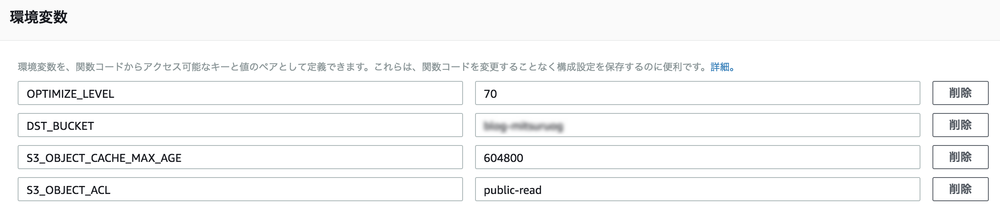

# s3-image-optimizer
This project just a hobby project to make sure how lambda works. this can be optimized image which after uploaded some S3 bucket.

This project based on this tutorial. please try this tutorial yourself before use this project. it would be amazing.

- https://docs.aws.amazon.com/lambda/latest/dg/with-s3-example.html

## Env variables
You can customize it a little by changing the following variables on the Lambda function page.

- OPTIMIZE_LEVEL: (default: 70)
  - (Integer) The number which Adjusts the jpeg|miff|png|tiff compression level. that ranges from 0 to 100 (best).
- DST_BUCKET: (default: source_bucket_name-optimized)
  - (String) The destination bucket name
- S3_OBJECT_CACHE_MAX_AGE: (default: 86400s)
  - (Integer) The seconds at which the object is no longer cacheable.
- S3_OBJECT_ACL: (default: private)
  - (String) The canned ACL to apply to the object. Possible values include:
    - "private"
    - "public-read"
    - "public-read-write"
    - "authenticated-read"
    - "aws-exec-read"
    - "bucket-owner-read"
    - "bucket-owner-full-control"

## Deploy
You can get zip ball by saying `npm run zip`. then you can see `deploy.zip` on root folder.
please upload it manually.

## Licence
MIT
